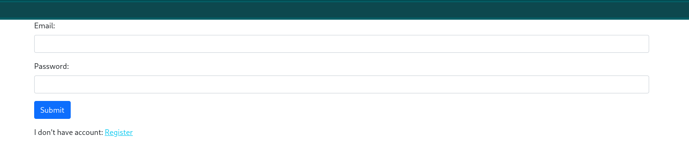
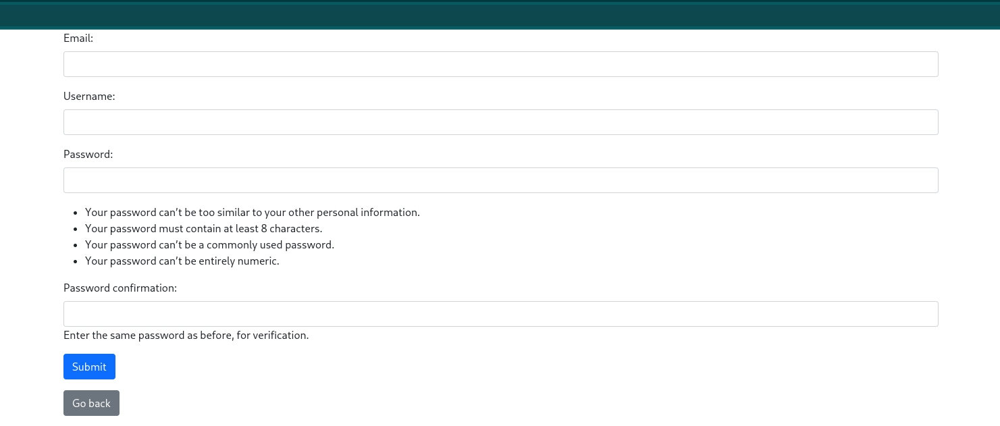
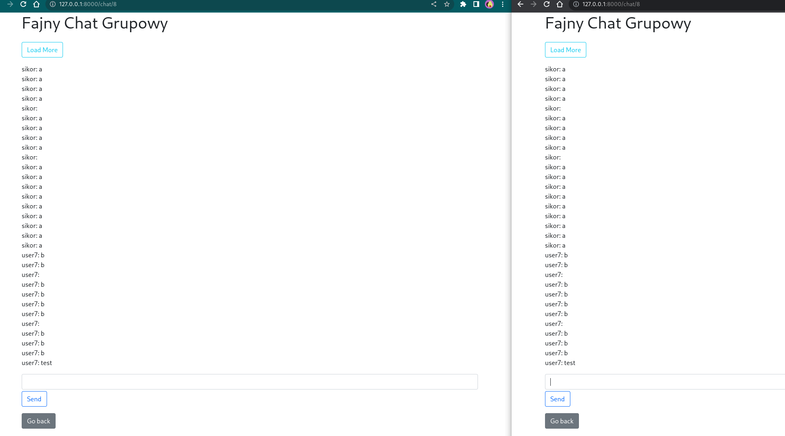
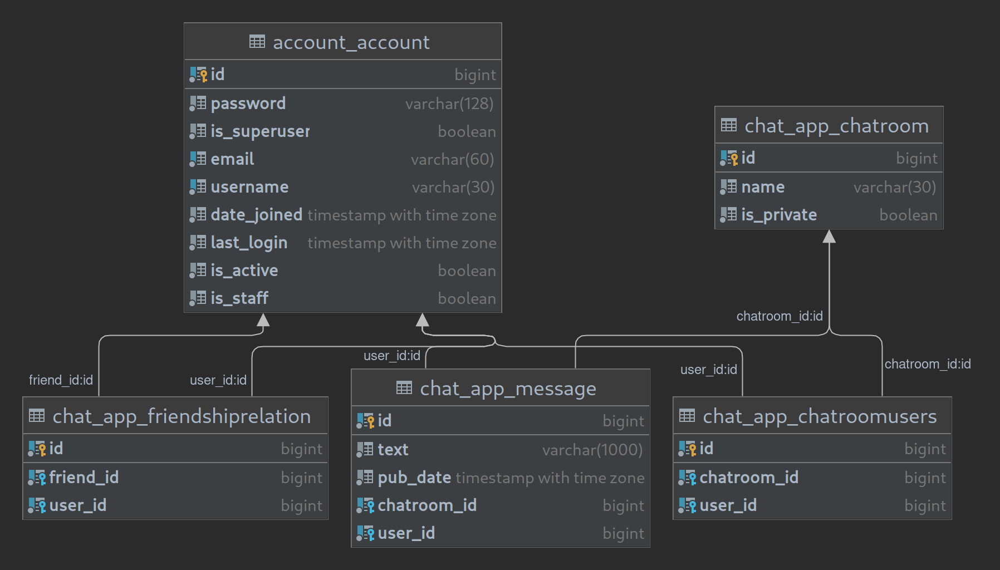

# Real time chat app in djagno using websockets

App writen in django framework with channels2.

## Features

App uses postgresql database for storing data such as user data, chatroom data, messages data. Redis is used in channel layer as sugested in channels2 documentation.

I wrote custom authentication model so that user can log in using email. Also email adress and username are unique. All is done according to django documentation.

Users can have private (2 person only) chatroom with friend, people they sent friend request and people by whom they were sent friend request.

Users can delete friends, cancel sent friend request and decline aquired friend request.

Private chatrooms are created on sent request and are not deleted on friend deletion, request decline or cancel. If a user were to resend request, chatroom would be reused. No messages would be lost.

Users can also create multiuser chatrooms with chosen friends.

Chatrooms initialy load latest 30 messages but users via load-more button can load as many older messages as they want without page refresh.

Messaging works in real time thanks to websocket. No refreshing is required.

App has very basic front end made in bootstrap 5 and some simple js code.

## Images of app

## Database

